# Architecture

The `acoustics-lab` crate ships a single binary, `acousticsd`,
that captures audio, classifies it on a hybrid CPU/NPU pipeline,
and exposes a control plane (HTTP/JSON) plus a streaming surface
(WebSocket + UDS).  Sibling docs:

- [`BUILD.md`](BUILD.md) — prerequisites, build, run, test, deploy.
- [`API.md`](API.md) — HTTP/streaming surface.
- [`LAYOUT.md`](LAYOUT.md) — bundled `misc/` fixture and runtime tree.
- [`PROTO.md`](PROTO.md) — streaming wire format.
- [`ARCH_BOUNDARIES.md`](ARCH_BOUNDARIES.md) — layer graph
  (composition root, allowed cross-edges).
- [`BENCHS.md`](BENCHS.md) — hot-path benches and the baseline
  contract.

## Module hierarchy

The crate is a single-binary monolith organised into five
layers; `daemon` is the only composition root.

```
L5  daemon     -- composes everything; owns drain_registry; only place that wires subsystems
L4  api        -- axum routes; AppState; HTTP/JSON + SSE control plane
L3  converter  training  inference  status  config
L2  model  preproc  opus_stream  stream_io  audio_io  audio_buffer
L1  common  file_mgr  -- common::traits, common::workspace types, file_mgr persistence
```

Two cross-module blockers (CMBs) live at L1 (`common` +
`file_mgr`) and percolate upward:

- **CMB #1 (Head artifact)** — Per-head `<head_id>.{mpk,json}`
  pair is the on-disk contract consumed by `model`,
  `inference`, `converter`, `training`, and `api`.  The shared
  trait surface lives in [`common::traits::head_store`](../modules/common/traits/head_store.rs);
  the on-disk shapes live in [`common::workspace`](../modules/common/workspace.rs)
  and the per-workspace persistence in
  [`file_mgr::schema`](../modules/file_mgr/schema.rs).
- **CMB #2 (Path safety)** — [`common::asset_path::AssetPath`](../modules/common/asset_path.rs)
  is the single validator consumed at every entry point that
  resolves a path under a workspace's `datasets/` tree
  (upload, asset GET / DELETE, train + convert input).

Module-level docs:

1. **Audio input.** ALSA capture (or a synthetic mock source
   on non-Linux dev hosts) feeds the
   [mic arbitrator](../modules/audio_io/mic_arbitrator.rs),
   which chooses an active mic + channel via launch-time
   policy + RMS arbitration with hysteresis and dwell, and
   writes mono PCM into a wait-free shared
   [audio buffer](../modules/audio_buffer.rs) at 44.1 kHz.

2. **Data processing.** Two independent consumers read the
   buffer: the [Opus encoder](../modules/opus_stream.rs)
   resamples to 48 kHz and emits 20 ms libopus frames (paused
   when no subscriber is attached), and the
   [hybrid inference engine](../modules/inference/engine.rs)
   slides a window across the buffer at a configurable hop
   and feeds it into preproc + backbone + head.

3. **Stream output.** The
   [stream router](../modules/stream_io.rs) fan-outs
   prost-encoded `Envelope` messages over WebSocket and raw
   UDS to external subscribers.  Wire format:
   [`PROTO.md`](PROTO.md); schema:
   [`modules/proto/`](../modules/proto/).

4. **Hybrid inference pipeline.** Pre-processing
   ([`preproc.rs`](../modules/preproc.rs)) runs a
   Blackman-windowed STFT on the CPU via `rustfft` /
   `realfft`.  The
   [backbone](../modules/inference/backbone.rs) runs a frozen
   feature extractor on the Rockchip NPU via the in-tree
   [`librknnrt` FFI wrapper](../modules/rknn_runtime/), with
   a Burn FP32 fallback for host dev (see
   [`model.rs`](../modules/model.rs) for the canonical Burn
   topology).  The
   [classifier head](../modules/inference/head.rs) runs a
   small linear matmul on the CPU.  Cadence (`hop_samples`,
   `top_k`) is hot-mutable via the API; head weights swap
   atomically via `HotHead`, but the persistent active head
   now lives under `<workspace_root>/active/` (see [Active
   head publication](#active-head-publication)).

5. **Training.** The
   [fine-tune engine](../modules/training/finetune.rs) walks
   a daemon-owned dataset tree class-by-class, opening files
   lazily per batch (FD ceiling = `batch_size *
   parallel_loaders`).  Output is published into the source
   workspace's 2-slot via the
   [trained-head publish helper](../modules/file_mgr/head_rotation.rs);
   reuses the inference preproc verbatim so training-time
   features match runtime byte-for-byte.

6. **Daemon orchestration.** [`daemon`](../modules/daemon/)
   wires every subsystem at boot and registers each
   long-running task with the
   [`drain_registry`](../modules/daemon/drain_registry.rs)
   for bounded shutdown.  The runtime restart model is
   **external process supervision** (systemd `Type=simple` /
   `Type=exec` with `Restart=on-failure`, or an equivalent
   runit/s6 setup); on drain-budget exhaustion the registry
   returns `false` and the daemon exits non-zero so the
   supervisor restarts a fresh process.

## CMB #1 — Head artifact contract

The trained-head artifact is a pair of files under
`<workspace>/heads/<head_id>.{mpk, json}`:

- `<head_id>.mpk` — raw Burn weights.  Loadable directly via
  `inference::HotHead::load`.
- `<head_id>.json` — [`HeadManifest`](../modules/common/workspace.rs)
  carrying: stable `head_id`; `workspace_id`;
  `workspace_revision`; published artifact `sha256` and
  `size_bytes`; `n_classes`; `created_at`; and the inline
  `labels[]` list.  The producer's input paths + numeric cfg
  live in the matching `{training,converter}_logs/<job_id>.jsonl`
  durable record only.

`labels[]` is intentionally embedded in the manifest (rather
than a sidecar `.txt`) so the trained-head publish is
index-atomic: staged `.mpk` + `.json` files are renamed under
the per-workspace mutation mutex before `heads.json` references
them.  A crash before the `heads.json` rewrite leaves only
unreferenced files (daemon-owned residue, swept by boot
recovery); a `heads.json` reference to a missing head file
cannot occur on the nominal path.

The shared trait surface
[`common::traits::head_store::HeadStore`](../modules/common/traits/head_store.rs)
exposes `snapshot_with_version`, `try_swap`, and
`install_prevalidated`.  `install_prevalidated` is the
infallible-modulo-process-abort runtime install used by the
active-head writer after on-disk publish has succeeded; the
preceding pre-load + validate step does all the parsing.

## CMB #2 — Path safety surface

[`common::asset_path::AssetPath`](../modules/common/asset_path.rs)
is the single validator for every operator-supplied path under
a workspace's `datasets/` or `converters/` trees.  See
[API.md / AssetPath](API.md#assetpath) for the full rule set.
Defence in depth: the route layer URL-decodes wildcard
captures before constructing an `AssetPath`, so smuggled
`%2E%2E%2F` reaches the parser as `../` and fails via
`LeadingDot`.

Mutation gate: an additional `validate_mutable_subpath` helper
(in [`file_mgr::dataset`](../modules/file_mgr/dataset.rs))
requires every upload / delete path to be workspace-rooted
(top-level `datasets/` or `converters/`) with at least one
child component.  The `AssetTree { Datasets, Converters }`
discriminant returned by the helper drives per-tree dispatch
(e.g. `JobType::DatasetDelete` vs `JobType::ConverterDelete`;
`dataset_mutations_rejected_total` vs
`converter_mutations_rejected_total` counters).

The validator allocates exactly one `String` on success (the
canonical owned form) and does no normalisation: the parsed
value is byte-identical to the input, so equality and hashing
are well-defined and a round-trip through serde is the
identity.  Wire shape is `try_from = "String", into =
"String"` so JSON / TOML deserialization fails closed at
parse time.

## Workspace lifecycle

### Create

`POST /workspace`:

1. Allocate a fresh `WorkspaceId`.
2. Create the workspace dir, the empty `datasets/`,
   `converters/`, `heads/`, `training_logs/`,
   `converter_logs/`, and `.tmp/` subdirectories.
3. Publish `workspace.json` LAST (so a directory without
   `workspace.json` is an incomplete create that boot
   recovery removes).  Initial `workspace_revision = { id: 0,
   at: created_at }`, `tags = []`, and `head_count = 0`.
4. Fsync workspace dir then root.

Names are validated for length (<=128 UTF-8 bytes), absence of
controls / NUL / path separators, no leading/trailing
whitespace, and uniqueness under Unicode case-insensitive
comparison via `str::to_lowercase` (simple case folding; no
NFC normalization).

### Summary

`GET /workspace/{id}`: reads only the cached
`ArcSwap<WorkspaceCore>` and `ArcSwap<HeadIndex>` cells.
Never walks `datasets/`.  Hot-path budget < 5 ms.

### Async delete

`DELETE /workspace/{id}` runs through the
[delete pipeline](#async-delete-pipeline) below.

## Active head publication

`POST /active` produces an independent runtime artifact under
`<workspace_root>/active/`, decoupled from the source
workspace's bytes.  Pipeline (see [`active_head_writer`](../modules/file_mgr/active_head_writer.rs)
+ [`api/routes/active.rs`](../modules/api/routes/active.rs)):

1. **Stage** the new generation under
   `active/.tmp/<activation_id>/` (random UUID).  Copy the
   source `<head_id>.mpk` (or the bundled-default `head.mpk`)
   and materialize `labels.txt` from the manifest's inline
   `labels[]`.  Compute both sha256s.
2. **Validate** (pre-load) on `tokio::task::spawn_blocking`:
   parse the staged `head.mpk` + `labels.txt` into an
   `inference::HeadInner`.  Failure here surfaces as a 4xx
   without ever publishing on-disk state.
3. **Publish** the staged directory into
   `active/generations/<activation_id>/` (atomic rename),
   fsync `generations/`, atomic-rewrite
   `active/current.json`, fsync `active/`.
4. **Install** the prevalidated runtime candidate into
   `HotHead` via `HeadStore::install_prevalidated`.  This
   step is infallible-modulo-process-abort (the candidate
   already passed `HeadInner::validate`).
5. **Prune** older generations on a best-effort basis (retain
   current + previous only).  Failure leaves residue for the
   next boot sweep.

Lock order (per redesign §8): the global active mutex is
acquired first; then, for `Head` origin, the per-workspace
mutation mutex (so workspace delete cannot race the head
lookup + source copy).  The `Default` arm takes only the
active mutex.

`GET /active` reads `active/current.json` then the pointed
`manifest.json`, validates the manifest, and (Head origin
only) augments the response with `source_workspace_alive`
(cheap stat of the source workspace dir).  Wait-free; never
takes the active mutex.

## Trained-head publication (2-slot rotation)

`POST /train` and `POST /convert` both publish through the
same primitive in [`file_mgr::head_rotation`](../modules/file_mgr/head_rotation.rs).
Holds the per-workspace mutation mutex throughout:

1. Stage new head bytes: write `<id>.mpk` + `<id>.json` into
   `<workspace>/.tmp/`.
2. Fsync both tempfiles.
3. Read current `heads.json`.
4. Compute next `heads[]`: prepend new entry; if `len > 2`,
   mark the tail for deletion.
5. Atomically rename tempfiles into `heads/<id>.mpk` +
   `heads/<id>.json`.
6. Fsync `heads/`.
7. Atomic-rewrite `heads.json` (tempfile + rename + parent fsync).
8. Atomic-rewrite `workspace.json` with refreshed `head_count`.
9. Delete the displaced head's `.mpk` and `.json` (if any).
10. Fsync `heads/`.

`heads.json` (step 7) is the publish point.  A file in
`heads/` not referenced by `heads.json.heads[]` is
daemon-owned orphan residue that boot recovery removes.

## Job registry + admission gates

Every long-running operation goes through the in-process
[`JobRegistry`](../modules/file_mgr/job_registry.rs):

- **Bounded concurrency**: `max_train_jobs = 1` daemon-wide,
  `max_convert_jobs = 1`, `max_delete_jobs = 1`.  Job records
  capped at `max_recent_jobs = max_running_jobs + 1` (default
  4).
- **Reference leases**: every running job records its
  [`JobReference`](../modules/common/workspace.rs)
  (`Workspace`, `DatasetTree`, `DatasetFile`).  New requests
  that overlap an existing reference (same workspace, same
  dataset file, ancestor / descendant of a dataset path) fail
  with HTTP 409 `job_conflict` BEFORE any work begins.
  Train requests fail with 409 `another_train_running` when
  another train job is unfinished daemon-wide.
- **Bounded event ring**: per retained job
  (`max_job_event_ring`, default 1024 events) plus a bounded
  broadcast channel for live SSE subscribers.  Ring overflow
  drops oldest events and increments `job_events_dropped_total`;
  durable history lives in the matching JSONL log.
- **Memory-only `/jobs` snapshots**: `GET /jobs` and
  `GET /jobs/{job_id}` never open log files.

Admission gates:
- `PUT /assets/{*path}`, `DELETE /assets/{*path}`,
  `POST /train`, `POST /convert`, and `DELETE /workspace/{id}`
  all consult the JobRegistry's overlap-detection before
  mutating.
- `POST /train` additionally checks the `max_train_jobs` cap
  (returns 409 `another_train_running` with a dedicated
  discriminator code).

## Boot recovery sweep

The daemon's first boot creates the workspace tree and writes
the bundled-default active generation.  Subsequent boots run
an idempotent recovery sweep
([`file_mgr::recovery`](../modules/file_mgr/recovery.rs)):

1. **Active head verify**: read `active/current.json`, then
   the pointed generation's `manifest.json`; streaming-hash
   `head.mpk` and `labels.txt`; regenerate `labels.txt` from
   manifest `labels[]` if only the label file is missing or
   stale.  If the current generation's head hash is wrong or
   the head fails to load, try the retained previous
   generation; if none is valid, write the bundled default
   through the same activation flow.  If the bundled default
   is missing/corrupt, boot without inference and mark status
   unhealthy rather than synthesising a production head.
2. **Per-workspace recovery**: for each workspace, complete
   any explicit
   `.tmp/delete-{assets,converters,training-logs,converter-logs}-*.json`
   tombstones (one pass per prefix), then walk `heads/` and
   drop any `<head_id>.{mpk, json}` whose `head_id` is not in
   `heads.json.heads[]`.  Parse `heads.json` once to repair
   `workspace.json.head_count` before serving summaries.
3. **Root staging cleanup**: complete any
   `<root>/.tmp/delete-workspace-*` payloads in batches.

Dataset files are daemon-owned; boot does NOT scan or
reconcile externally staged files under `datasets/`.

Counter side-effects: every orphan swept increments
`boot_orphans_swept_total` (visible via `GET /api/v1/status`).

## Async delete pipeline

Every workspace-asset delete and the workspace delete follow
the **tombstone -> revision-bump (where applicable) -> stage
-> drain -> finalize** ordering
([`file_mgr::staging`](../modules/file_mgr/staging.rs)).  The
publish-step under-lock is < 10 ms; the bulk payload removal
happens in batches (`max_delete_batch_entries`, default 256)
without holding workspace locks.

Asset delete (`DELETE /assets/{*path}`):

1. JobRegistry overlap check (409 `job_conflict` on overlap).
   For log trees (`training_logs/`, `converter_logs/`) the
   dispatcher additionally pre-checks for an active producer
   in the same workspace and returns 409 with a producer-named
   diagnostic.
2. Lock the workspace; write the per-tree tombstone JSON under
   `<workspace>/.tmp/`.  Filename prefix dispatches the tree:
   `delete-assets-<job_id>` (datasets), `delete-converters-<job_id>`
   (converters), `delete-training-logs-<job_id>`,
   `delete-converter-logs-<job_id>`.  Fsync `.tmp/`.
3. (`datasets/...` / `converters/...` only) Atomic-rewrite
   `workspace.json` with the next `WorkspaceRevision`.  Log
   trees skip this step — logs aren't workspace state in the §9
   sense, so the revision counter doesn't track them.
4. Rename the target file/tree into the matching staging
   payload directory.
5. Fsync the old parent dir and `.tmp/`.
6. (`datasets/...` / `converters/...` only) Publish the new
   core cache.  Unlock.
7. Worker: remove the staged payload in bounded batches; emit
   progress / log events to the JobRegistry.  Boot recovery's
   four per-prefix sweeps resume any drain interrupted by a
   daemon crash.

Workspace delete (`DELETE /workspace/{id}`):

1. JobRegistry overlap check.  Under the active-then-workspace
   lock order, record whether the current active head was
   sourced from this workspace (so the terminal job snapshot
   carries `active_source_deleted`).
2. Stage a delete marker; atomically move the workspace
   directory to `<root>/.tmp/delete-workspace-<job_id>/payload`.
3. Fsync the workspaces root and root `.tmp/`.
4. Remove the workspace from the hot workspace cache.
5. Worker: remove the staged payload in bounded batches.

Active inference is unaffected: the active generation's bytes
are independent of any source workspace.

## Diagram

```dot
digraph BackendArchitecture {
    rankdir=LR;
    node [shape=box];
    compound=true;

    subgraph cluster_input {
        label="Audio Input";
        style=dashed;
        ALSA [label="ALSA Capture"];
        MicSwitch [label="Mic Arbitrator\n(RMS + hysteresis)"];
        AudioBuffer [label="Shared Audio Buffer\n(wait-free, 44.1 kHz)"];
    }

    subgraph cluster_proc {
        label="Data Processing";
        style=dashed;
        OpusEnc [label="Opus Encoder\n(pausable)"];

        subgraph cluster_hybrid {
            label="Hybrid Inference";
            style=dashed;
            WinSlice [label="Window Slicer\n(dyn hop / top_k)"];
            CPUPrep [label="STFT Preproc\n(CPU rustfft / realfft)"];
            NPUBackbone [label="Backbone\n(NPU RKNN)"];
            CPUHead [label="Classifier Head\n(CPU Burn .mpk)"];
        }
    }

    subgraph cluster_out {
        label="Stream Output";
        style=dashed;
        Serializer [label="Envelope\n(prost / proto3)"];

        subgraph cluster_socket {
            label="Stream Router\n(WebSocket / UDS)";
            style=dashed;
            AudioStream [label="/stream/audio"];
            InferenceStream [label="/stream/infer"];
        }
    }

    subgraph cluster_train {
        label="Training";
        style=dashed;
        BurnTrain [label="Burn fine-tune\n(FP32 .mpk backbone)"];
    }

    subgraph cluster_daemon {
        label="Daemon Orchestration";
        style=dashed;
        API [label="HTTP API\n(/api/v1/*)"];
        ConfigMgr [label="Config Cell\n(launch + user TOML)"];
        FileUp [label="FsService\n(file_mgr workspace ops)"];
        Jobs [label="JobRegistry\n(bounded; references; SSE fanout)"];
        ActiveWriter [label="Active-Head Writer\n(<root>/active/)"];
        ModConv [label="Converter\n(TFJS -> .mpk)"];
        SysMon [label="Status Monitor\n(heartbeats + sysinfo + workspace counters)"];
    }

    ALSA -> MicSwitch;
    MicSwitch -> AudioBuffer;

    AudioBuffer -> OpusEnc [label="read"];
    AudioBuffer -> WinSlice [label="read"];

    WinSlice -> CPUPrep;
    CPUPrep -> NPUBackbone;
    NPUBackbone -> CPUHead;

    OpusEnc -> Serializer [label="audio pkt"];
    CPUHead -> Serializer [label="top_k"];
    Serializer -> AudioStream;
    Serializer -> InferenceStream;

    CPUPrep -> BurnTrain [label="reuse preproc"];

    API -> ConfigMgr;
    API -> FileUp;
    API -> Jobs;
    API -> ActiveWriter;
    API -> ModConv;
    API -> SysMon;
    API -> AudioStream [label="subscribe"];
    API -> InferenceStream [label="subscribe"];

    FileUp -> Jobs [label="reference leases"];
    ModConv -> Jobs [label="convert job lease"];
    Jobs -> BurnTrain [label="train spawn"];
    BurnTrain -> FileUp [label="publish_trained_head"];

    ActiveWriter -> CPUHead [label="install_prevalidated"];
    ActiveWriter -> FileUp [label="<root>/active/ atomic publish"];

    ConfigMgr -> MicSwitch [label="mic policy"];
    ConfigMgr -> WinSlice [label="hop / top_k"];
}
```


