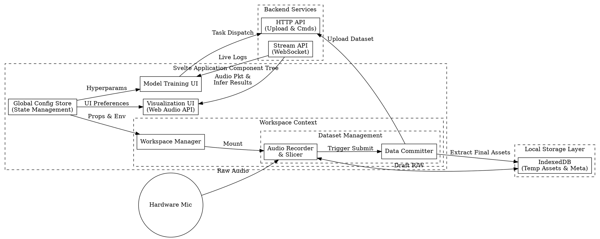

# System Design for Acoustics Lab Frontend

## A. Functional Modules Breakdown

The system can be categorized into the Dashboard Tab (Visualization Module + Configuration Module), Workspace Tab (Workspace Management Module + Dataset Management Module + Model Training Module + Tiny Dashboard Module + History Module), Converter Tab (Tiny Dashboard Module) and Health Monitoring Badge Module:

1. Visualization Module: Responsible for the real-time display of current audio and inference streams. It provides interactive features such as adjusting display parameters, selecting different visualization modes (e.g., waveforms, spectrograms), and rendering inference results (e.g., event categories, confidence scores).

2. Configuration Module: Offers a user interface for global settings that span multiple modules. This includes selecting microphone devices and adjusting inference parameters (e.g., audio overlap ratio, selection of Head weights hot-swap settings).

3. Workspace Management Module: Responsible for managing user workspaces, including creation, deletion, and modification. It ensures the isolation and security of data and model files within each workspace, and logically encompasses the Dataset Management Module.

4. Dataset Management Module: Handles the CRUD of datasets, including audio recording or uploading (e.g. input device selection, from microphone or audio stream, format conversion, clip trimming, etc.), visualization (waveform), playback, slicing (clip into sample segments), and segments visualization (spectrograms, quality analysing), ultimately generating training dataset files consumable by the backend fine-tuning module. Temporarily edited data is cached in the browser using IndexedDB, while finalized data is uploaded to the backend via HTTP API for permanent storage and management.

5. Model Training Module: Provides a user interface for model training operations. This includes configuring hyperparameters (e.g., learning rate, epochs, validation split), initiating the training process, monitoring training status, and viewing training logs (realtime).

6. Tiny Dashboard Module: A lightweight dashboard that provides the functionality of quickly checking the current audio and inference stream outputs, Head weights hot-swaping, as a tiny Dashboard Module. It serves as a quick access point for users to monitor the system's performance without needing to navigate to the full Visualization Module or Model Training Module in the Dashboard Tab.

7. History Module: A module that maintains a historical log of training or converting operations, including timestamps, workspace names, dataset details, training configurations, and outcomes. This allows users to review past activities and results for reference and analysis.

8. Health Monitoring Badge Module: A small badge that displays the current health status of the system, including backend connectivity, inference engine status, and resource usage. Hovering over the badge provides quick access to detailed health information and troubleshooting tips.

## B. User Interaction Flow

1. Landing on Dashboard Tab - Upon launching the frontend, users are greeted with the Dashboard Tab, where they can immediately observe the Visualization Module displaying real-time audio and inference streams. The Health Monitoring Badge provides an at-a-glance status of the system's health.

2. Navigating to Workspace Tab - Users can navigate to the Workspace Tab to manage their workspaces and datasets. Here, they can create a new workspace, record or upload audio samples for fine-tuning, and manage these samples through playback, slicing, and deletion. Once the dataset is prepared or updated, users can sync it to the backend for training.

3. Model Training - After submitting the dataset or updating existing datasets, users can scroll to the Model Training Module to configure hyperparameters and initiate the training process. The module provides real-time updates on training status and logs, allowing users to monitor progress and troubleshoot if necessary. Note also consider providing useful informations, e.g. there's already have a trained Head weight and it revision matches the current dataset, do you want to skip training and directly hot-swap the Head weight for inference?, etc.

4. Quick Monitoring - At any point, users can utilize the Tiny Dashboard Module for a quick check of the current audio and inference stream outputs, as well as to perform quick hot-swapping of Head weights without needing to navigate away from their current workspace or training session.

5. Reviewing History - Users can access the History Module to review past training or converting operations, allowing them to analyze previous configurations and outcomes for better decision-making in future operations.

6. Converter Tab - For users needing to convert model formats, they can navigate to the Converter Tab, which provides a streamlined interface for selecting source and target formats, uploading model files, and initiating the conversion process. The Tiny Dashboard Module can also be utilized here for monitoring conversion status and outputs. Note the converter tab actully automatically create a workspace with a special name and tag, the name should be preserved for Workspace Management and History Module, but the workspace itself is hidden from user in Workspace Tab, and only visible in Converter Tab, also supporting quick access to the converted model files for download or direct hot-swap in inference, and manual freeup the workspace after conversion.

7. Error Handling and Feedback - Throughout the user interaction flow, the system provides appropriate feedback and error handling mechanisms. For instance, if there are issues with audio recording, dataset submission, or training initiation, the system should provide clear error messages and guidance on how to resolve these issues.

## C. Design Considerations

1. Design Goals: This design scheme aims to provide a user-friendly, logically clear, and fully functional frontend interface for local fine-tuning. It requires deep architectural consideration regarding data affinity and performance optimization (e.g., ensuring zero-latency playback of dataset audio). This allows users to effortlessly conduct fine-tuning training for acoustic events and immediately observe and validate the results, thereby elevating overall system performance and user experience.

2. UX and Error Handling: Each step in the workflow above requires the system to provide appropriate guidance and feedback. This ensures users can smoothly complete the fine-tuning process while clearly understanding the purpose and operational methods of each phase. Additionally, the system must incorporate robust error handling and exception feedback mechanisms to assist users in resolving any issues encountered during operation.

3. Core Design Principles:
    1. Consistency & Conventions
        - Maintain absolute uniformity in visual elements (colors/typography/spacing) and interactions (identical components must exhibit identical behaviors).
        - Adhere to established industry conventions; do not reinvent the wheel (e.g., clicking the top-left logo returns to the homepage).
    2. Instant & Clear Feedback
        - Every interactive action (Hover/Click/Loading/Success/Error) must yield visual or textual feedback within a reasonable timeframe (e.g., under 400ms).
        - Never leave the user guessing about the system's current state.
    3. Visual Hierarchy & Whitespace
        - Align layouts with natural scanning behaviors (F-pattern or Z-pattern). Call-to-Action (CTA) elements must carry the highest visual weight.
        - Utilize whitespace (rather than structural lines) to divide information blocks. Apply the Gestalt principle of proximity to group related elements together.
    4. Simplicity & Hick's Law
        - Maximize the signal-to-noise ratio by removing all non-essential decorations.
        - Manage high information density by employing progressive disclosure or step-by-step wizards.
    5. Forgiveness & User Control
        - Provide "emergency exits": modals must be easily dismissible, high-risk actions should be reversible (Undo), and proactive constraints should prevent errors before submission.
        - Error messages must be constructive and conversational. Explain what went wrong in plain language and offer clear, actionable solutions.
    6. Clear Affordances & Signifiers
        - UI elements must "look like what they do." Buttons should appear clickable, links must be visually distinct, and critical features should not be buried behind complex hovers or deep menus.
    7. Accessibility (a11y)
        - Ensure text-to-background contrast ratios strictly meet WCAG standards.
        - Interfaces must fully support keyboard-only navigation (`Tab`, `Enter`, `Space`) with highly visible focus states.
        - Prioritize semantic HTML tags (e.g., `<nav>`, `<button>`, `<dialog>`) and appropriate ARIA attributes for screen readers.

## D. Architectural Considerations

1. Technology Stack Recommendations: Regarding the frontend technology stack, it is recommended to use the Svelte framework paired with Tailwind CSS to leverage its highly efficient component-based development paradigm and reactive characteristics. This should be combined with the Web Audio API for audio processing and visualization, IndexedDB for local data storage, and the Fetch API for backend data interaction. Furthermore, a modular code structure is recommended to ensure clear separation of concerns among functional modules and maintain high maintainability.

2. Project Pacing: We have ample time to make perfect decisions; we will proceed step-by-step, conduct thorough in-depth research, and formulate correct and reasonable plans.

3. Future-proofing: The design should be flexible and extensible to accommodate future enhancements, such as additional visualization modes, support for more complex training configurations, or integration with other backend services. This ensures that the frontend can evolve alongside the backend and continue to meet user needs effectively.

4. Performance Optimization: Given the real-time nature of audio processing and inference visualization, performance optimization is crucial. This includes efficient handling of audio data, minimizing latency in visualization updates, and ensuring smooth user interactions even during intensive operations like training.

5. Extra context:
    1. Keep the design slim, simple and intuitive, keep codespace clean, tidy, no docs required.
    2. Ensure that the frontend is responsive and works well across different devices and screen sizes.
    3. Prioritize user experience by providing clear feedback, easy navigation, and helpful error messages throughout the application.
    4. Consider security implications, especially when handling user data and interactions with the backend, ensuring that appropriate measures are in place to protect user information and maintain system integrity.
    5. No need for testing or benchmarking considerations in the frontend design, the web frontend project should be compact, small, slim and efficient.
    6. No need for CI/CD pipeline considerations, no need for tracking, it mainly a static webpage.
    7. Futher stage requires Light/Dark mode support, and internationalization (i18n) support, but we can defer these to later stages after the core functionalities are implemented and stabilized.
    8. We have a lot of time to make perfect decisions, we will proceed step-by-step, conduct thorough in-depth research, and formulate correct and reasonable plans
    9. Backend APIs located in `docs/API.md`, with other backend design details in `docs/`.
    10. Use latest SvelteKit with Vite, and Tailwind CSS for rapid UI development, write top-tier, idiomatic, clean, maintainable code with best practices in mind, and ensure the architecture is modular and scalable for future enhancements.
    11. Double check for correctness, efficiency, robustness and consistency, and ensure the design adheres to the core design principles outlined above.

## E. System Architecture Diagram (DOT format):

